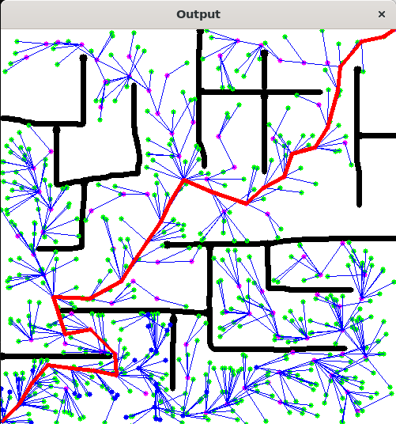
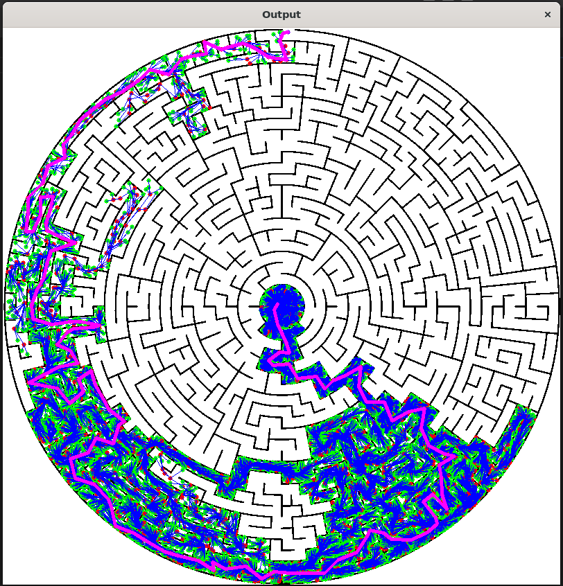

# RRT for Path Planning in ROS

## The Task
Implement the Rapidly Exploring Random Trees (RRT) algorithm to plan collision-free paths in a 2D environment.

## How to run it?
Place it in your catkin workspace `src` folder and build it using:
```bash
catkin build
```

You can run the launch file given in the `launch` folder using:
```bash
roslaunch rrt_planner rrt_planner.launch map:=
```
Input the name of the map to launch after map:=

This launch file automatically launches three nodes:
- **RViz** For visualization
- **Map Server** to load a map from a .png file and publish it as a `nav_msgs::OccupancyGrid` on the `/map` topic
- **RRT Planner** to receive a map, initial pose, and goal pose, and calculate and publish a collision-free path as a `nav_msgs::Path` msg

#### Map Server
2 example map images are provided in the [resources](resources) directory that can be used to test your RRT implementation.
The map server node is responsible for loading a map file and publishing it as a `nav_msgs::OccupancyGrid` on the `/map` topic.
To select the map file that should be loaded and published, configure the parameters in [cfg/map.yaml](cfg/map.yaml) file.

#### RViz
When a map has been loaded successfully it should be visible in RViz. The user can then set the initial pose and the goal pose through RViz.
Press the `2D Pose Estimate` button in RViz to set the initial pose. Press the `2D Nav Goal` button in RViz to set the goal pose.
Or you can provide the same through the topics `/initialpose` and `/move_base_simple/goal` respectively.

## Tuning
Parameters can be provided to the RRT Planner node using the [cfg/config.yaml](cfg/config.yaml) file.
Certain RRT parameters can be made configurable by adding them to this file.

## Results

